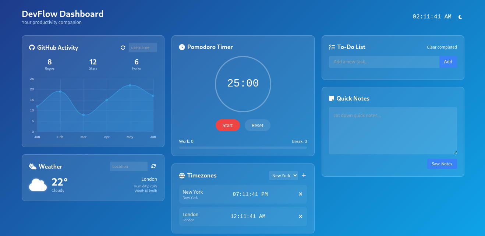

# DevFlow Dashboard

https://thinker18624.github.io/Developer-Dasboard/



A beautiful, productivity-focused dashboard for developers featuring GitHub stats, Pomodoro timer, to-do list, weather widget, timezone tracker, and quick notes.

## Features

- **GitHub Activity Tracker**
  - View repository, star, and fork counts
  - Visualize commit history with interactive chart
  - Search any GitHub user

- **Pomodoro Timer**
  - 25-minute work sessions with 5-minute breaks
  - Visual progress indicator
  - Session counter

- **To-Do List**
  - Add, complete, and delete tasks
  - Clear completed tasks
  - Persistent storage using localStorage

- **Weather Widget**
  - Current temperature and conditions
  - Humidity and wind speed
  - Search by location

- **Timezone Tracker**
  - Track multiple timezones
  - Add/remove timezones
  - Real-time clock updates

- **Quick Notes**
  - Persistent note-taking
  - Auto-save functionality

## Technologies Used

- HTML5
- CSS3 (with Tailwind CSS)
- JavaScript
- Chart.js for data visualization
- Font Awesome for icons
- GitHub API (mock implementation)

## Installation

No installation required! This is a client-side only application.

1. Clone the repository:
   ```bash
   git clone https://github.com/Thinker18624/developer-dashboard.git

   
⭐ Star this repository if you found it helpful! ⭐ Thank you
